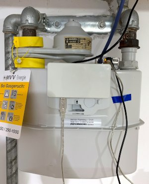
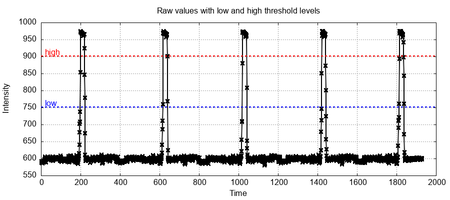

# Overview

This project is about reading the counter of [diaphragm gas volume meter](https://en.wikipedia.org/wiki/Gas_meter) which is commonly installed in residential properties to count and bill the consumed gas. The last dial of the meter has a reflective sticker, which can be utilised to detect a full revolution of the dial.

In some meters the reflective sticker is made from a magnetic material and a very sensitive magnetometer is sufficient to detect the changes in the earth magnetic field when the sticker passes by the sensor. In the first version of this project used the [SparkFun 3-axis magnetometer](https://www.sparkfun.com/products/retired/12670) to detect a full revolution of the .001 m³ digit wheel. Since my gas meter was replaced with a new non-magnetic version, the magenetometer sensor doesn't work anymore.

Here I describe a new sensor device, which uses an infrared LED and a phototransistor to detect the changes in reflectivity when the reflective sticker on the last dial passes by the phototransitor. The measurement principle was inspired by the [pulsemeter](https://github.com/ahpohl/pulsemeter) and the device looks like this when mounted in front of the gas meter:



The schematics, board layout and part list of the gasmeter dongle hardware is described in more detail in the [Gasmeter wiki](https://github.com/ahpohl/gasmeter/wiki).

On the software side, the Gasmeter program reads the current gas volume from the meter and forwards it to a MQTT broker on the network. The data is stored in a TimescaleDB database and visualised on a Grafana dashboard. The installation of the software stack, including the setup and maintainance of the database, is described on the [Smartmeter](https://github.com/ahpohl/smartmeter/wiki) wiki pages.

## Build instructions

To compile Gasmeter from source, a Makefile for (cross-)compilation is provided:

```
make CROSS_COMPILE=aarch64-unknown-linux-gnu
make install
```

Alternatively, there is also an Arch Linux package called [gasmeter](https://aur.archlinux.org/packages/gasmeter) published in the AUR.

The hardware dongle needs firmware for the Atmel microcontroller in order to communicate with the gasmeter program. To compile the firmware, first install the AVR toolchain through your package manager. On Arch Linux, install `avr-gcc` and `avr-bin` packages and then `make upload` to compile and upload the firwmare. On a new microcontroller, a bootloader needs to be flashed first to accept a firmware image via upload. The preparation of a new µC is described in the [wiki](https://github.com/ahpohl/gasmeter/wiki).

## Installation

The Arch Linux package provides a systemd service file and installs the configuration file in `/etc/gasmeter/gasmeter.conf`. The service can be started with:

```
systemctl start gasmeter
```

When building directly from source, the daemon can be directly started with:

```
gasmeter --config resources/config/gasmeter_example.conf

```

## Run in Docker

The Arch Linux package installs a docker compose in `/etc/gasmeter/docker-compose.yaml` and a `Dockerfile`. Alternatively, these files are also in the root folder or the source. Before building and starting the container, the serial device used by the gasmeter hardware needs to be set in `docker-compose.yaml` in addtion to `gasmeter.conf` to give Docker access to the device.

```
docker-compose up --build
```

## Configuration

The Gasmeter program is configured with a configuration file located in `/etc/gasmeter/gasmeter.conf`. At least the serial device of the hardware, the MQTT hostname and topic to publish to needs to be set. Optionally, Gasmeter supports MQTT password authentication and TLS connection encryption. Finally, the gas tariff, which consists price per kWh, a yearly service charge and the gas conversion factor (found on the last bill), needs to be set here for the current bill to be shown on the dashboard.

On first run, the low and high threshold parameters need to be determined. For this, there is a special `raw_mode` option in the config file, which outputs the raw sensor values to the console. To record values create a log file with:

```
gasmeter --config gasmeter.conf | tee ir.log
```

Plotting the raw values gives a diagram like this (the gnuplot script is provided in the resources folder):

```
gnuplot < sensor.gnuplot > ir.png
```



The threshold level low needs to be set slightly above the baseline and level high below the maximum of the raw value. The larger the difference between the baseline and the maximum, the better the tolerance against noise and variations in reflected light intensity. Here the baseline is around 600 and the maximum at 950-1000 and a low level of 750 and high level of 900 works well.

A minimal `gasmeter.conf` config file looks like this:

```
serial_device /dev/ttyUSB0
mqtt_broker localhost
mqtt_topic gasmeter
gas_rate 261.80
gas_price 0.0583
gas_factor 10.835
level_low 750
level_high 900
```

## JSON output

Example JSON published by Gasmeter in the `gasmeter/live` topic:

```
{
  "time":1730287096822, # timestamp, secs since epoch
  "volume":4207.18,     # gas volume, m³ 
  "state":0,            # detection of volume change
  "rate":235.40,        # yearly service rate
  "price":0.1042,       # price per kWh, € (or whatever)
  "factor":11.048       # gas conversion factor, kWh*m³
}
```

## Future development

* Replace the host running gasmeter with an ESP32 version mounted directly on the PCB
* Web interface with MQTT and firmware download capability
* ESP32 version inspired by [AI-on-the-edge](https://github.com/jomjol/AI-on-the-edge-device) and the [Opentherm gateway](https://www.nodo-shop.nl/en/featured/211-opentherm-gateway.html)